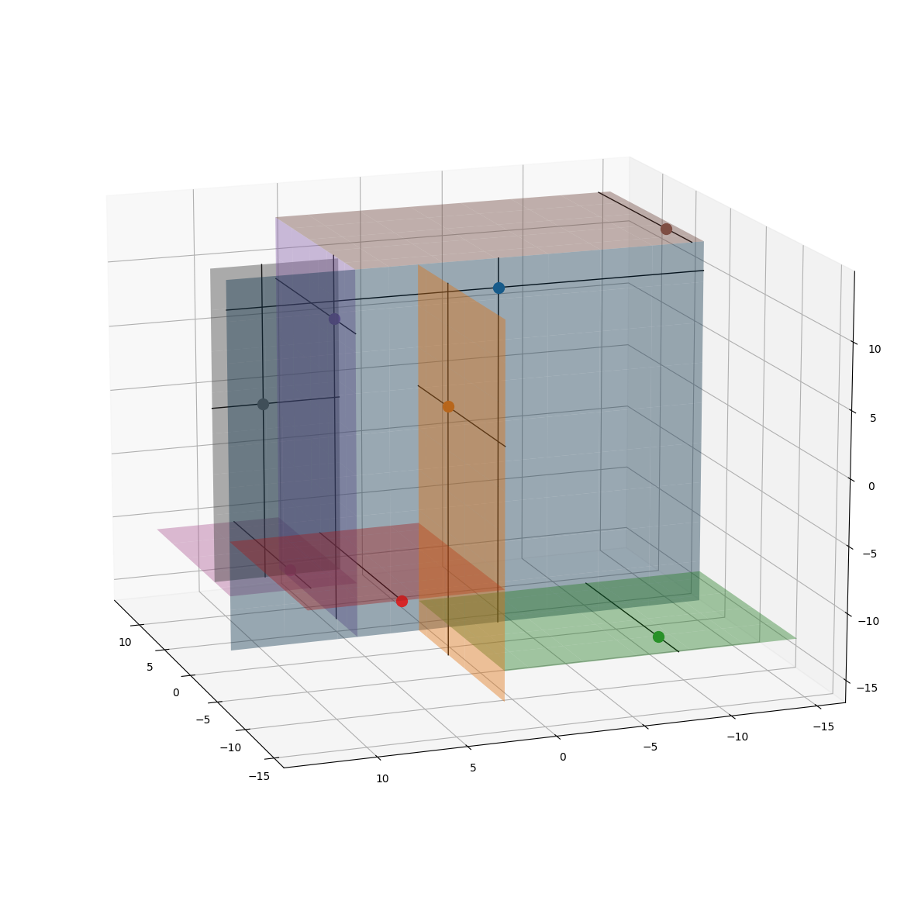
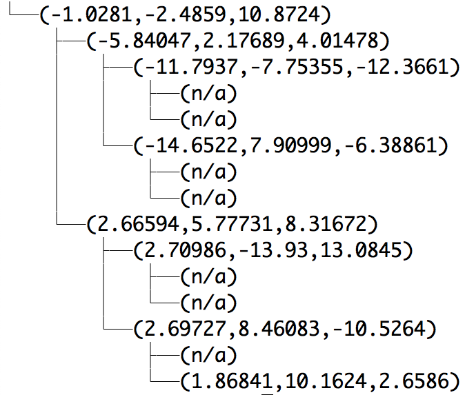
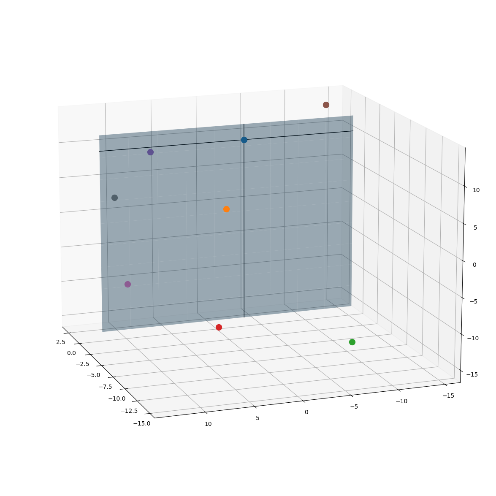
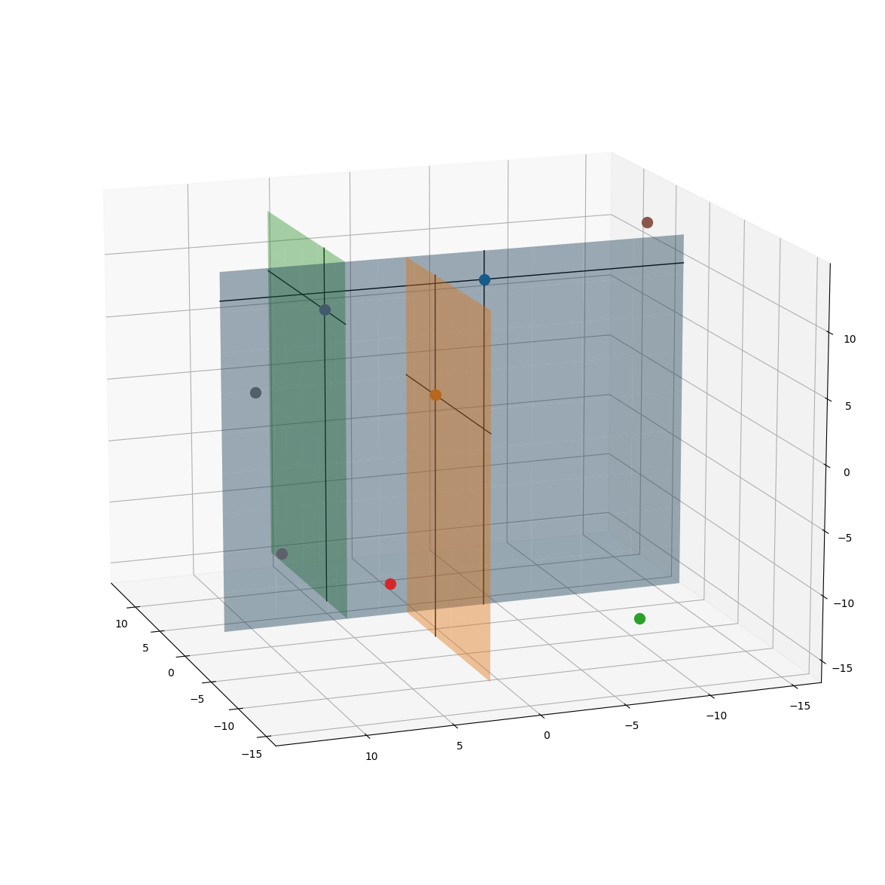
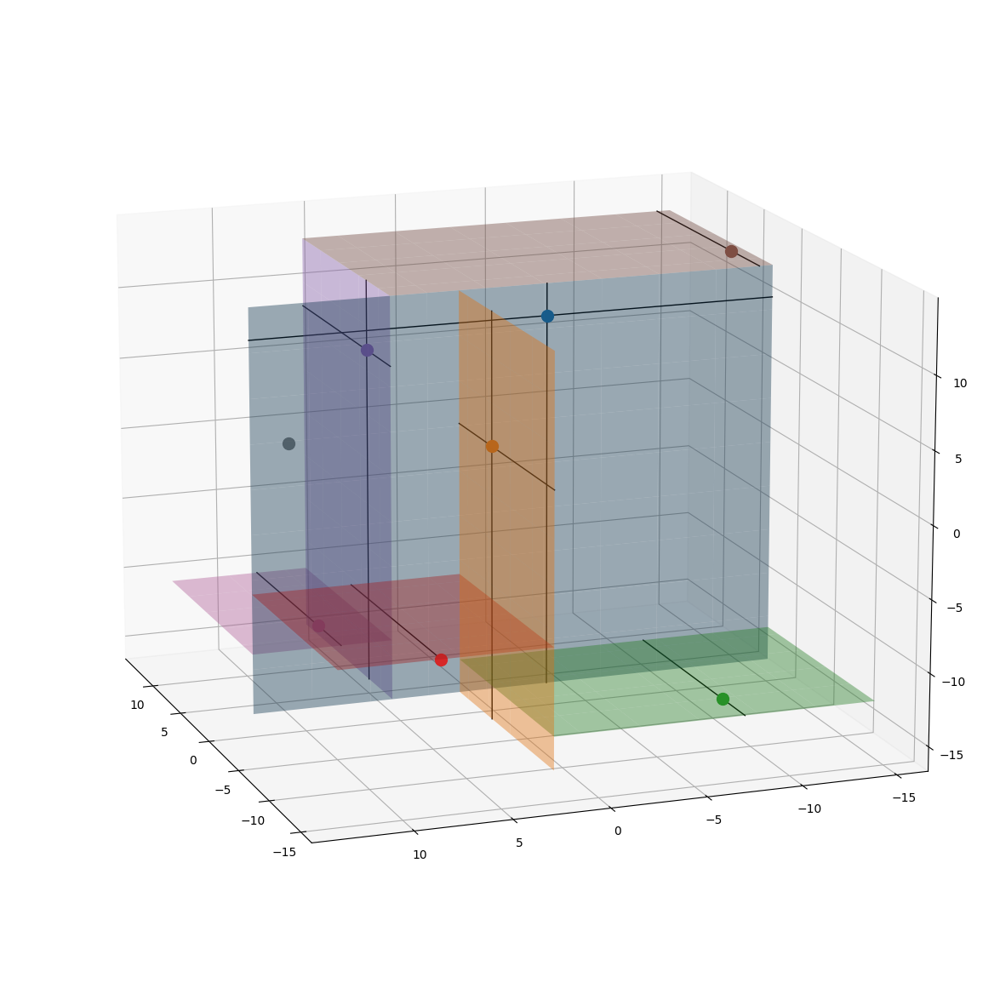
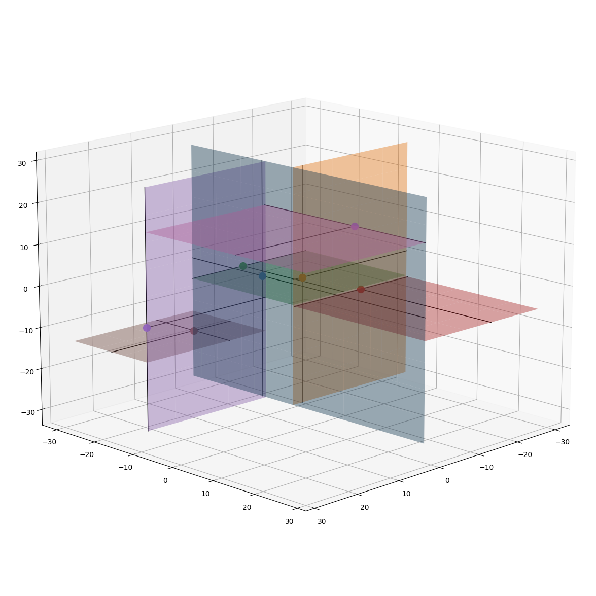
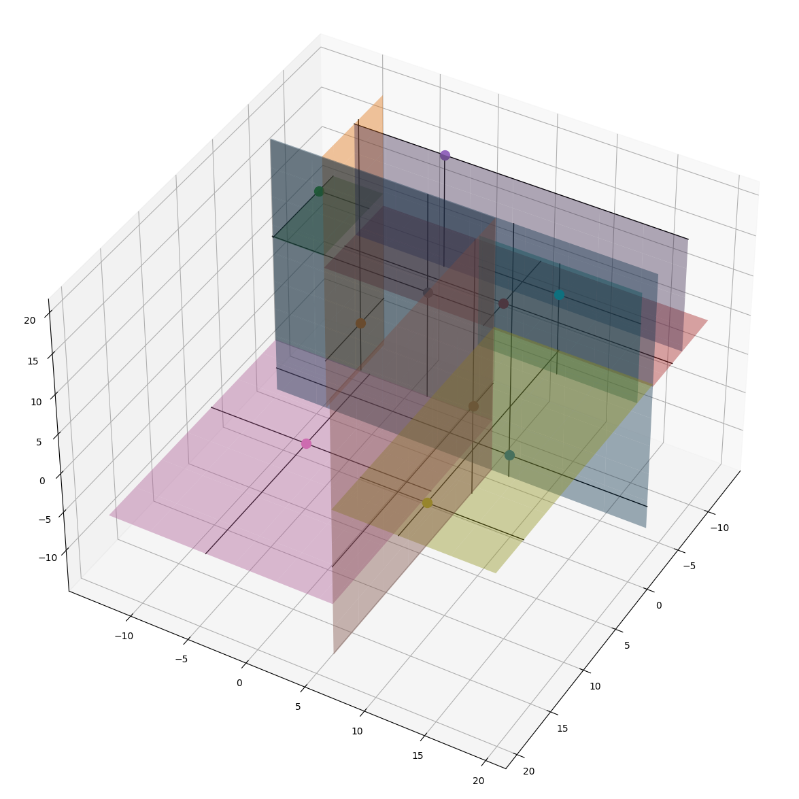

# Parallel k-d tree

Parallel implementation of k-d tree using MPI, OpenMP and C++17.

## Summary

A _k-d tree_ is a data structure which can be used to represent k-dimensional
points in a convenient way. This kind of representation can be used to implement
algorithms like K-Nearest Neighbors (KNN) very efficiently [2].

Below you find two possible representations for a k-d tree (k=3):
Visual | Textual
--- | ---
 | 

The procedure employed to build such a structure is the following:

1. Choose one axis;
2. Determine the median point of the dataset with respect to the axis;
3. For each one of the two halves, go back to `1`.

**Note**: The median point is the data point which splits the dataset in two
halves along the chosen axis.

The algorithms stops when the dataset contains only one point. Below you find
the progression of the algorithm at increasing depths of the tree:

| Depth 0                                               | Depth 1                                               | Depth 2                                               |
| ----------------------------------------------------- | ----------------------------------------------------- | ----------------------------------------------------- |
|  |  |  |

A k-d tree may be represented with a binary tree, whose nodes
are defined approximately in the following way:

```cpp
struct Node {
    // k-dimensional value
    double *data;

    Node *left;
    Node *right;
};
```

We assume that our data can be represented using a `double` value.

## Parallelization

### MPI

The strategy employed for the parallelization with MPI consists in delegating
one of the two branches resulting from a split to one of the available processes
waiting. At the beginning we start with only one process (which we refer to as
'`rank0`') processing the data. After the split (step `2`) `rank0` produces two
branches. The right branch (data greater than the median along the chosen axis)
is assigned to a new process ('`rank1`'), which then carries out the computation
independently. The left branch is kept by `rank0`.

This same strategy is then employed recursively by `rank0` and `rank1`, until
the tree is completed.

### OpenMP

The strategy is very similar to the one presented in [MPI](#mpi), we use
[task](https://www.openmp.org/wp-content/uploads/sc15-openmp-CT-MK-tasking.pdf)s
to distribute the work easily.

## Compile

Clone the repository and navigate to the folder `src`. A `Makefile` is
available along with the following recipes:

| Recipe     | Result                                                                                                                                                              |
| ---------- | ------------------------------------------------------------------------------------------------------------------------------------------------------------------- |
| `output`   | Show only the output (i.e. the textual representation of the tree).                                                                                                 |
| `file`     | Save the k-d tree as a CSV file, each node is saved in order of increasing level starting from the root (left to right).                                            |
| `time`     | Show only the time it took to build the k-d tree.                                                                                                                   |
| `debug`    | The binary produced will show both debug messages and output.                                                                                                       |
| `leaks`    | Find memory leaks in the source code. The executable does not produce any output.                                                                                   |
| `mpidebug` | Produces an executable that can be debugged using gdb (the rank of the process to be controlled via gdb must be set via the environment variable `MPI_DEBUG_RANK`). |

Moreover, in order to choose between MPI and OpenMP, you should append the
command-line parameter (e.g. `src=mpi`). By default (i.e. if `src` is omitted)
we use OpenMP. The result of the compilation is the file `tree_omp.x` (or
`tree_mpi.x`).

For instance, the following produces the executable `tree_mpi.x` which prints
only the time needed to build the tree using MPI:

```
make time src=mpi
```

## Usage

Run the executable `tree_omp.x` (or `tree_mpi.x`) generated in
[Compile](#compile) with:

```bash
# OpenMP
./tree_omp.x
```

or

```bash
# MPI
mpirun -np ... tree_mpi.x
```

### Specify a dataset

By default the dataset used is the file `benchmark/benchmark1.csv`, but you can
specify your own dataset via a command line argument. Valid datasets are CSV
files where each data point has the same number of components (one data point
per row).

For example, the following command builds a k-d tree on the dataset inside the
file `foo.csv` in the current directory:

```bash
# here we use MPI and 10 processors
# foo.csv must exist and be well-formatted
mpirun -np 10 tree_mpi.x foo.csv
```

### Save results

If you compiled with the recipe `make file` (see [Compile](#compile)) you can
save the result to a CSV file, which allows you to do some more things on your
k-d tree (see [Visualization](#visualization)). You need to provide a path
where the result can be saved (filename, not directory).

For example, this saves the tree constructed on the dataset in `data.csv` and
saves it in `output_tree.csv` in another directory:

```bash
# the folder ../results should exist
./tree_omp.x data.csv ../results/output_tree.csv
```

## Visualization

After constructing a k-d tree you may want to visualize it in some graphical
way. In the folder `visualization` we provide an experimental tool to do just
that.

Suppose there is a k-d tree stored in a CSV file called `output.csv` in the
folder `results`, which has been generated using this library. This is very
important, since using a CSV file which does not represent a k-d tree results
in very bad-looking results.

Navigate to the folder `visualization`, we visualize the directory tree for
clarity:

```
└──kd-tree
    ├──benchmark
    ├──src
    ├──results
    │   └──output.csv            # <- k-d tree to be visualized
    └──visualization             # (*)
        ├──converter.py
        └──visualize_kd_tree.py
```

Open an interactive Python interpreter and write the following commands:

```python
>>> from visualize_kd_tree import KDTreeVisualization
>>> from converter import csv_to_tree

# we obtain a Python representation of the root of the k-d tree
>>> root = csv_to_tree('../results/output.csv')

# show the tree in an interactive Matplotlib window
>>> KDTreeVisualization().visualize(root)
```

| 6 Data Points                       | 10 Data Points                      |
| ----------------------------------- | ----------------------------------- |
|  |  |

There are some configurations available:

```python
# save the image in 'output_figure.png'
# the figure is 30x30 (default is 20x20) and 200 dpi (default is 100)
>>> KDTreeVisualization().visualize(
...     root, figsize=(30, 30), dpi=200, filename="output_figure.png"
... )

# - decrease the opacity of the surface drawn to represent a split (default is
#   plane_alpha=0.4);
# - decrease the width of lines parallel to a split surface
#   (default is intersection_lines_width=3);
# - increase the size of split points in the 3D volume (default is
#   point_size=75)
>>> v = KDTreeVisualization(
...     plane_alpha=0.2, intersection_lines_width=1, point_size=100
... )
>>> v.visualize(root)
```

## Roadmap

- [x] Working MPI implementation;
  - [ ] Optimize the last call to `finalize()`: maybe it's not needed (since we traverse the tree in `utils.convert_to_knodes()`);
  - [x] Fix some memory leaks.
- [x] Working OpenMP implementation;
  - [x] Fix _false sharing_.
    - [ ] Check that the fix improves performance.
- [ ] Testing;
- [x] Visual representation of the tree;
- [x] Catchy images in README;
- [ ] Allow setting number of components per data point in compilation to improve performance;
- [x] Put OpenMP and MPI implementations in the same file;
- [ ] Performance evaluation;
- [ ] Comparison against other implementations(?)

## Interesting points
+ `right_branch_memory_pool` (see `kdtree.h`);
+ Two different write modes (for *false sharing*).

## References

1. Friedman et al. 1977, ["An algorithm for finding best matches in logarithmic expected time."](https://www.researchgate.net/profile/Raphael-Finkel/publication/220493118_An_Algorithm_for_Finding_Best_Matches_in_Logarithmic_Expected_Time/links/0912f50bf7e8351954000000/An-Algorithm-for-Finding-Best-Matches-in-Logarithmic-Expected-Time.pdf)
2. [Wikipedia](https://en.wikipedia.org/wiki/K-d_tree)
